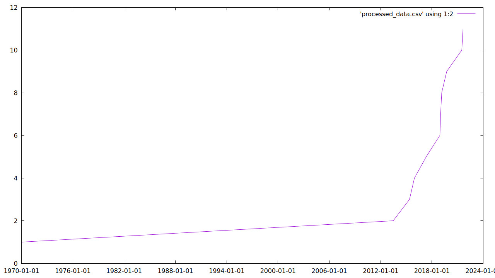

# Part 2: Evaluation of Existing Code

I reviewed `projects/initial-data/` as an existing proof of concept for collecting observability data about the JSON Schema ecosystem. The project gathers GitHub repositories using the `json-schema` topic and records repository creation time and first release information, then writes the collected data to CSV for later processing and plotting.

The main thing it does well is validate the overall idea. It demonstrates that ecosystem data can be collected from GitHub and transformed into a basic historical signal. it starts from a clear data source, focuses on one ecosystem slice, and produces an artifact that can be inspected and visualized. I was able to run it locally on a reduced sample of 10 repositories and generate a plot from the resulting CSV using `gnuplot-nox`.

Its limitations become clearer when thinking about recurring observability rather than one-off experimentation. The setup is still fairly manual, I have to install csvkit, gnuplot to run follow-up shell commands in order to sort and reshape the output before graphing. The repository also ships with CSV outputs already checked in, which is convenient for inspection but suggests the workflow is not yet centered around a clean automated pipeline. In my own run, I had to create the `data` directory myself and install `csvkit` separately to reproduce the documented post-processing flow.

A second limitation is the output format. CSV is fine for an exploratory script, but for long-term ecosystem observability I would rather produce structured, typed data that can feed a dashboard system directly. My current direction is to target formatted outputs that can later be consumed by a standard open-source dashboard stack such as Grafana. In that context, a collector that emits normalized JSON snapshots or time-series-friendly records would be a better fit than a workflow that depends on extra shell processing. This matters because dashboarding tools benefit from stable schemas, explicit timestamps, and machine-readable metadata.

I also noticed a robustness issue around missing metadata. The README says the script tries to determine first release information, and during my run many repositories failed while fetching release data. In practice, some repositories simply do not have releases, so that condition should be treated as valid missing data rather than as a noisy failure. For an ecosystem-wide collector, this distinction is important because incomplete metadata is normal and should not make the pipeline look unhealthy.

My recommendation is to start fresh rather than build directly on this code. The existing project is valuable as a reference because it proves the metric idea, identifies a workable data source, and shows one possible processing flow. However, I do not think it is the right foundation for a recurring observability system.

If starting fresh, I would keep the idea that producing reusable collected data and add more metrics so the resulting dataset can support a richer dashboard rather than a single narrow chart. My goal would be to collect multiple structured signals of ecosystem activity and format them in a way that can be consumed directly by a dashboarding tool such as Grafana.
